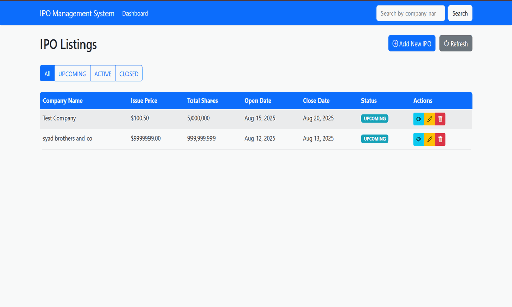

# IPO Platform (Spring Boot + MySQL + Docker)

A production-ready Spring Boot application to manage Initial Public Offerings (IPOs) with REST APIs and a simple Bootstrap/Thymeleaf UI.

## Demo (add your GIF here)

Place your demo GIF at `docs/demo.gif` and it will render below:



> Tip: Create the `docs/` folder and drop your GIF there. Update the path if you prefer a different location.

## Architecture
- Backend: Spring Boot (REST, JPA/Hibernate, Validation, Thymeleaf)
- Database: MySQL (Docker) for prod; H2 in-memory for local dev
- Build: Maven
- Runtime: Java 17 (Eclipse Temurin)
- Container: Docker + Docker Compose

## Features
- CRUD for IPOs
- Search by company name
- Filter by status (UPCOMING, ACTIVE, CLOSED)
- Responsive Bootstrap UI
- Clean REST responses with a standard `ApiResponse<T>` envelope

## Tech Stack
- Java 17, Spring Boot 2.7.x
- Spring Web, Spring Data JPA, Spring Validation, Thymeleaf
- MySQL 8 (prod), H2 (dev)
- Docker, Docker Compose, Maven

## Quick Start

### 1) Run with Docker (recommended)
The app publishes on host port `8081` (to avoid conflicts like Jenkins on 8080).

```bash
# from project root
docker-compose up -d

# open UI
http://localhost:8081

# health
http://localhost:8081/api/test/health
```

Env used by the app container (see `docker-compose.yml`):
- `SPRING_PROFILES_ACTIVE=prod`
- `DB_HOST=mysql`
- `DB_PORT=3306`
- `DB_NAME=ipo_db`
- `DB_USERNAME=root`
- `DB_PASSWORD=password`

### 2) Run locally (H2 dev)
```bash
mvn clean package
java -jar target/ipo-application-1.0.0.jar

# open UI
http://localhost:8080
```
This uses in-memory H2 defined in `application.properties`.

## Configuration

### Dev (`application.properties`)
- H2 in-memory:
  - `spring.datasource.url=jdbc:h2:mem:ipo_db`
  - H2 driver is NOT forced (auto-detected)

### Prod (`application-prod.properties`)
- MySQL via env variables (Docker):
  - `spring.datasource.url=jdbc:mysql://${DB_HOST}:${DB_PORT}/${DB_NAME}?useSSL=false&allowPublicKeyRetrieval=true&serverTimezone=UTC&createDatabaseIfNotExist=true`
  - `spring.datasource.driver-class-name=com.mysql.cj.jdbc.Driver`
  - `spring.jpa.database-platform=org.hibernate.dialect.MySQL8Dialect`
  - `spring.jpa.hibernate.ddl-auto=create-drop` (for bootstrap demos; change to `update` or `none` for real prod)

## API Reference
Base URL (Docker): `http://localhost:8081`

- `GET /api/test/health` – Health check
- `GET /api/ipos` – List all IPOs
- `GET /api/ipos/{id}` – Get IPO by id
- `POST /api/ipos` – Create IPO
- `PUT /api/ipos/{id}` – Update IPO
- `DELETE /api/ipos/{id}` – Delete IPO
- `GET /api/ipos/search?name=Tech` – Search IPOs by company name
- `GET /api/ipos/status/{status}` – Filter IPOs by status (UPCOMING, ACTIVE, CLOSED)

Example create request (PowerShell):
```powershell
$json = @{
  companyName = "New Tech Inc."
  issuePrice  = 100.50
  totalShares = 5000000
  openDate    = "2025-08-15"
  closeDate   = "2025-08-20"
  status      = "UPCOMING"
  description = "A new technology company"
} | ConvertTo-Json

Invoke-RestMethod -Uri "http://localhost:8081/api/ipos" -Method Post -ContentType "application/json" -Body $json
```

## Database Schema (MySQL)
The `schema.sql` creates table `ipos` and adds indexes. In Docker, it is mounted and applied at startup.

Columns: `id, company_name, issue_price, total_shares, open_date, close_date, status, description, created_at, updated_at`.

## Troubleshooting
- Jenkins already on 8080:
  - We mapped app to host `8081` in `docker-compose.yml` (`8081:8080`). Use `http://localhost:8081`.
- MySQL/H2 driver mismatch:
  - Ensure `application-prod.properties` sets `spring.datasource.driver-class-name=com.mysql.cj.jdbc.Driver`.
  - Do NOT force H2 driver in base `application.properties`.
- Rebuild stack cleanly:
  ```bash
  docker-compose down
  docker-compose build --no-cache
  docker-compose up -d
  ```
- Check logs:
  ```bash
  docker-compose logs mysql
  docker-compose logs app
  ```

## Contributing
PRs and issues welcome. Please open an issue first to discuss major changes.

## License
MIT

## Repository
`syaddays/ipo-platform` — https://github.com/syaddays/ipo-platform 